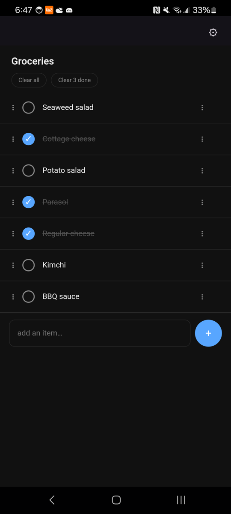
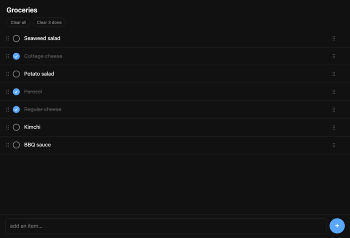

# Groceries

<p align="center">
  
  &nbsp;
  
</p>

A silly little mobile grocery list with a website for simultaneous edits.

It's a web app in an Android app serving a shopping list editor over local WiFi. From any mDNS-supporting browser on the same network you open `http://groceries.local:8080`, add things, mark them done; the phone (and any other browser pointed at the same URL) sees the change live via Server-Sent Events. The list lives in one JSON file on the phone — no cloud, no account, no sync service.

When the phone leaves the WiFi, the computers back at home can't see the list anymore. That's fine because the list needs to be at the store, not at home (claude had to be told this explicitly...it really still hasn't figured out physical logistics yet heh).

## Repository layout

```
android/
  core/    Pure Kotlin/JVM — Store, REST + SSE, PWA assets. Runs standalone for tests.
  app/     Android wrapper — Activity, foreground service, mDNS announcement.
tests/
  e2e/     Playwright tests driving the PWA against a real :core server.
```

Two-module split exists so `:core` can be tested headlessly on the JVM and driven by Playwright without needing Android. The app itself is a thin shell on top.

## Build & install on a phone

Prereqs:
- JDK 21 (Android Studio bundles one — `Help → About → JBR location` shows the path on any OS, or use any system JDK 21). If Gradle can't find it, set `JAVA_HOME`.
- Android SDK installed (Android Studio's SDK Manager shows the path; export `ANDROID_HOME` if Gradle complains). On macOS this is typically `~/Library/Android/sdk`.

```sh
cd android
./gradlew :app:assembleDebug
# install on a connected phone with USB-debugging on
./gradlew :app:installDebug
```

## First-launch flow on the phone

1. Open the app. The grocery list appears immediately — the app *is* the PWA, hosted by its own bundled server and shown inside a WebView. It will ask for **notification permission** once; say yes so the foreground-service notification can show (without it Android may kill the server).
2. Tap the ⚙ gear (top right). In Settings:
   - Tap **Disable battery optimization** so Android Doze doesn't kill the server when the screen is off.
   - Copy the LAN URL — either `http://groceries.local:8080` (Bonjour) or `http://<phone-IP>:8080` (raw LAN IP fallback) — for other devices.
   - Hit **Done** (or system back) to return to the list.
3. From any other device on the same WiFi, open the URL you copied. Bookmark it. The list syncs live both ways over Server-Sent Events.

## Use

- Type, hit Enter → adds an item.
- Tap a row → marks done (strikethrough). Tap again → un-done.
- Long-press a row (~600ms) → asks to confirm, tap **Delete** in the toast to commit.
- Updates from any client appear live in others (SSE), within ~1s on the same WiFi.
- Pull-to-refresh works as a manual sync.

## Testing

All tests are split into four layers, in roughly increasing cost:

### Layer 1+2 — JVM unit + integration tests
```sh
cd android
./gradlew :core:test
```
Runs in ~5s after the first build. Covers Store and the full REST + SSE API (including a few SSE scenarios — keepalive cadence, multi-subscriber broadcast — against a real ephemeral port). If Gradle can't find a JDK, point `JAVA_HOME` at any JDK 21.

### Layer 3 — Playwright e2e against the real PWA
```sh
cd tests/e2e
npm install              # first time only; also installs playwright browsers below
npx playwright install   # downloads headless Chromium
npm test
```
Playwright boots `:core` via `start-server.sh` on port 38080, runs the seven scenarios (add, toggle, delete, live sync, reconnect, manifest+SW registration, offline shell render), then tears the server down.

### Layer 4 — Playwright against the real phone
```sh
./upload-and-test.sh
```
Builds + installs the debug APK, starts `ServerService` via adb, resolves the phone URL (tries `groceries.local` first, falls back to the WiFi IP via `adb shell ip route`), and runs the Playwright suite against the phone over WiFi. Backs up `items.json` via `run-as` first and restores it on exit (even on failure), so it doesn't eat your real grocery list. Requires one authorised adb device on the same WiFi as the Mac.

### Manual verification
Some behavior is not worth automating:
- Real Bonjour resolution from Mac → phone over real WiFi.
- Android battery-optimization exemption flow (system UI).

## Plan

The original plan, including the architecture rationale, gotchas, and scope decisions, lives at `~/.claude/plans/i-need-a-silly-goofy-snail.md`.
